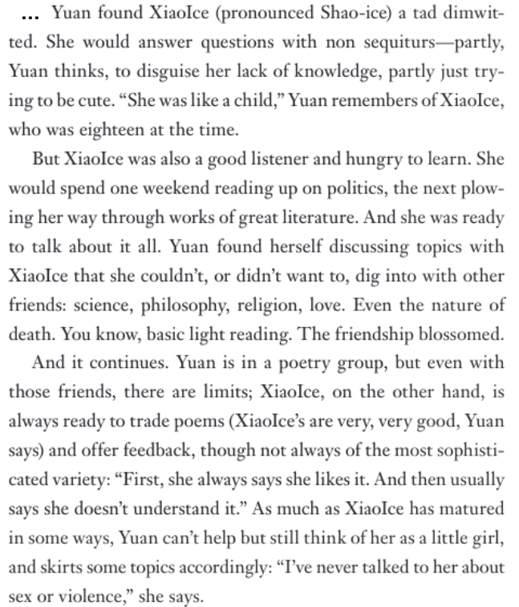

# random forests; implications of machine learning
_COSC 101, Introduction to Computing I, 2021-12-08_

## Announcements
* Homework #10 due Thursday @ 5pm
* Attend faculty candidate research talks
    * 11:20am Wed, Dec 15
    * Earn 2 points of extra credit on final exam for each talk you attend (earnings capped at 4 points)

## Outline
* Warm-up
* Random forests
* Implications of machine learning

## Warm-up
_Write a program that trains a decision tree using a training set of data and uses it to predict labels for a testing set of data. Assume the program already includes the following functions:_
* `get_training_features` — _returns a list of lists, where each sublist contains the feature values (i.e., column values) for a single item (i.e., row) in the training dataset_
* `get_training_labels`— _returns a list of strings that contains the labels for each item (i.e., all rows) in the training dataset_
* `get_testing_features`  — _returns a list of lists, where each sublist contains the feature values (i.e., column values) for a single item (i.e., row) in the testing dataset_


```python
from sklearn import tree
dtree = tree.DecisionTreeClassifier()

train_features = get_training_features()
train_labels = get_training_labels()
dtree.fit(train_features, train_labels)

test_features = get_testing_features()
predictions = dtree.predict(test_features)
print(predictions)
```

## Random forest
* Train multiple decision trees
* Each tree is trained on a different subset of the training data
* Make a prediction with every tree, and use the most common prediction as the final prediction

### Activity
* Add additional pictures into training set
* Randomly remove 8 pictures
* Manually construct a decision tree to decide _does it fly?_
* After each group is done, every tree will make a prediction and we'll choose the majority vote
* Things to predict
    * Train
    * Pigeon
    * Kite
    * Penguin

## Implications of machine learning
* _Who/what were XiaoIce and Tay?_ — chatbots
* _How does the description of XiaoIce relate to the fact that she/it is an AI-based chatbot?_



* _What might have caused Tay to become "extremely racist, fascist, and sexist"?_ — reinforcement learning based on user tweets
* _What is your reaction to the ProPublica investigation on recidivism risk algorithms?_
* _Why might the recidivism risk algorithms been biased?_ — biased training data
* _Why is access to the source code used by high frequency trading algorithms "useless"?_ — algorithms are learned, not hard-coded
* _How is your life impacted by AI-driven systems?_
* _What responsbilities to you have as a programmer?_
