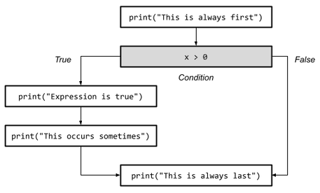

# Hello, Python: boolean expressions; conditionals
_COSC 101, Introduction to Computing I, 2021-09-06_

## Announcements
* Homework 1 due Thursday at 11pm
    * Office hours today 2:30-4pm
    * Open lab hours Sunday-Thursday 7-10pm

## Outline
* Warm-up
* Boolean expressions
* Order of operations

## Warm-up
_For each program: (1) indicate what it will output, and (2) draw a reference diagram depicting the state of each variable after the program has executed._


```python
#1)
a = 1
b = 2
a = a + b
print(a, b, a)
```

    3 2 3


```
    ┏━━━━┓
a━━>┃  3 ┃
    ┗━━━━┛
    ┏━━━━┓
b━━>┃  2 ┃
    ┗━━━━┛
```


```python
#2)
a = 1
a = a + 2
b = a + 3
b = b + 4
print(a, b)
```

    3 10


```
    ┏━━━━┓
a━━>┃  3 ┃
    ┗━━━━┛
    ┏━━━━┓
b━━>┃ 10 ┃
    ┗━━━━┛
```


```python
#3)
a = 1
b = a + 3
a = b + 2
b = a + 4
print(a, b)
```

    6 10


```
    ┏━━━━┓
a━━>┃  6 ┃
    ┗━━━━┛
    ┏━━━━┓
b━━>┃ 10 ┃
    ┗━━━━┛
```


```python
#4)
quarter = "beet "
half = "mel-on"
measure = quarter * 2 + half
print(measure)
measure = "wa-ter-" + half
print(measure)
```

    beet beet mel-on
    wa-ter-mel-on


```
          ┏━━━━━━━━━┓
quarter━━>┃ "beet " ┃
          ┗━━━━━━━━━┛
          ┏━━━━━━━━━━┓
   half━━>┃ "mel-on" ┃
          ┗━━━━━━━━━━┛
          ┏━━━━━━━━━━━━━━━━━┓
mesaure━━>┃ "wa-ter-mel-on" ┃
          ┗━━━━━━━━━━━━━━━━━┛
```

## Boolean expressions

### Overview
* _How many boolean values are there?_ — True, False
* Boolean expression evaluates to `True`, or `False`
    * E.g., numerical comparison (`<`, `>`, `<=`, `=>`, `==`, `!=`)
    * E.g., boolean operators applied to boolean expression(s) (`and`, `or`, `not`)
    
### Practice

_Which of the following are valid boolean expressions?_

\#1) `True`

Valid — `True` is a boolean value

\#2) `"True"`

Invalid — `"True"` is a string, not a boolean value

\#3) `1 < 2`

Valid — comparison of integers evaluates to a boolean value (`True` or `False`)

\#4) `3 = 3`

Invalid — use double equals (`==`) for equality comparison; single equals (`=`) is used for (re)assignment

\#5) `4 >= 4`

Valid — `>=` means greater than or equal to; as noted above, comparison of integers evaluates to a boolean value

## Order of operations

### Overview
* Order (highest-to-lowest predence)
    * Parenthesis — `()`
    * Math operations
        * Power — `**`
        * Multiplication/division — `*`, `/`, `//`, `%`
        * Addition/subtraction — `+`, `-`
    * Comparison — `==`, `!=`, `<`, `>`, `<=`, `>=`
    * Boolean operations
        * `not`
        * `and`
        * `or`

### Practice

_Assume the following assignment statements have been executed:_


```python
x = -2
y = 0
z = 5
```

_What does each of the following boolean expressions evaluate to? If the expression is an invalid boolean expression, describe why._


```python
#1)
x < 0 and y < 0
```


    False


```python
#2) 
z > 3 and z < 7
```


    True


```python
#3)
y not == 0
```


      File "/var/folders/bd/35sz70xs5837wszrx11bw1yc0000gn/T/ipykernel_790/2795633142.py", line 2
        y not == 0
              ^
    SyntaxError: invalid syntax


```python
#4)
x < y or (z >= 0 and y <= 5)
```


    True


```python
#5)
x + y < z
```


    True


```python
#6)
"a" < "b"
```


    True


```python
#7)
"b" < "C"
```


    False


## Conditional statements

### Overview
* Used to influence program’s behavior based on the result of a boolean expression
* If statement — execute one set of instructions when the specified boolean expression is true and execute a different set of instructions when the expression is false
    ```Python
    if boolean expression:
        statements when true
    else:
        statements when false
    ```
    * Statements must be indented
    * Else clause is optional
* Sequence of execution is non-linear
    * Only execute one set of statements, based on the result of the boolean expression
    * Skip over other set of statements
* Drawing a flowchart is useful

### Example
```Python
print("This is always first")
if (x > 0):
	print("Expression is true")
	print("Hooray!")
else:
	print("Expression is false")
	print("Uh-oh!")
print("This is always last")
```


### Example without else clause
```Python
print("This is always first")
if (x > 0):
	print("Expression is true")
	print("This occurs sometimes")
print("This is always last")
```



### Practice
_For the following programs: (1) draw a flowchart and (2) specify what output will be produced._


```python
#1)
hour = 12
if (hour == 12):
    print("noon")
if (hour > 12):
    print("AM")
else:
    print("PM")
```

    noon
    PM


```python
#2)
cost = 200
refund = 3
if (cost > 100):
    refund = 10
refund = refund * 2
print(refund)
```

    20


## Extra practice

### Boolean operations
_What is the output of each of the following programs?_


```python
#1)
print("True or True is", True or True)
print("True or False is", True or False)
print("False or True is", False or True)
print("False or False is", False or False)
```

    True or True is True
    True or False is True
    False or True is True
    False or False is False


```python
#2)
print("True and True is", True and True)
print("True and False is", True and False)
print("False and True is", False and True)
print("False and False is", False and False)
```

    True and True is True
    True and False is False
    False and True is False
    False and False is False


### Conditional statements

\#3) Write a program that asks the user a yes/no question and outputs `Correct` or `Incorrect` based on whether the user's answer. For example:
```
Is a whale a mammal? yes
Correct
```


```python
answer = input("Is a whale a mamal? ")
if (answer == "yes"):
    print("Correct")
else:
    print("Incorrect")
```

    Is a whale a mamal? yes
    Correct


\#4) Write a program that asks the user to enter two numbers and outputs whether or not the first number is evenly divisible by the second number. For example:
```
First number: 10
Second number: 5
10 is evenly divisible by 5
```


```python
first = int(input("First number: "))
second = int(input("Second number: "))
if (first % second == 0):
    print(first, "is evenly divisble by", second)
else:
    print(first, "is not evenly divisble by", second)
```

    First number: 10
    Second number: 5
    10 is evenly divisble by 5

