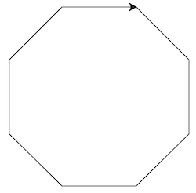
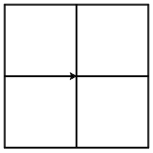

# for loops
_COSC 101, Introduction to Computing I, 2021-09-13_

## Announcements
* Homework 2 due Thursday at 5pm

## Outline
* Warm-up
* Turtle graphics
* for loop
* Refactoring code
* range

## Warm-up
_Write a program that asks for the size of an angle in degrees and converts the angle to radians. Hint: 180° = π_


```python
import math
degrees = float(input("Degrees? "))
radians = (degrees / 180) * math.pi
print("Radians:", radians)
```

    Degrees?  180


    Radians: 3.141592653589793


## Turtle graphics

* Useful for illustrating computational thinking
* _What do you need to do before you can draw with a turtle?_
    * Import the module — `import turtle`
    * Create a graphics window — `window = turtle.Screen()`
    * Create a `Turtle` object — `bowser = turtle.Turtle()`
* Useful Turtle functions
    * `forward(steps)` — move forward by the specified number of steps
    * `left(degrees)` — turn to the left by the specified number of degrees
    * `right(degrees)` — turn to the right by the specified number of degrees
    * `up()` — stop drawing
    * `down()` — resume drawing
    
### Practice

\#1) _Write a program that draws the number 2 (like on a digital clock)._


```python
import turtle
window = turtle.Screen()
bowser = turtle.Turtle() # Bowser is a fictional character in Nintendo's Mario series

bowser.forward(50)
bowser.right(90)
bowser.forward(50)
bowser.right(90)
bowser.forward(50)
bowser.left(90)
bowser.forward(50)
bowser.left(90)
bowser.forward(50)

window.exitonclick()
```

\#2) _Write a program that draws an equilateral triangle_


```python
import turtle
window = turtle.Screen()
shelly = turtle.Turtle() # Shelly is a Muppet turtle who appeared on the television show Sesame Street

shelly.forward(100)
shelly.left(120)
shelly.forward(100)
shelly.left(120)
shelly.forward(100)

window.exitonclick()
```

## for loops

### Overview
* _What is the purpose of a for loop?_ — to do something repeatedly without duplicating the same code
* Syntax:
    ```Python
    for loop_variable in list:
        repeatedly executed statements (i.e., the loop body)
    ```
* _How many times is the loop body executed?_ — as many times as there are items in the list; each time is called an iteration
* When is the loop variable updated?_ — before the loop body is executed each time (i.e., before each iteration)
* _What is executed after the loop is finished?_ — the statements that come after the loop body and have the same level of indentation as the line containing `for`


### Practice

_What is the output of each of the following programs?_


```python
#1)
for num in [5,4,3,2,1]:
    print(num)
```

    5
    4
    3
    2
    1


```python
#2)
for tree in ['apple', 'orange', 'pear']:
    print(tree)
```

    apple
    orange
    pear


```python
#3)
for num in [1,2,3,4,5,6]:
    if num%2 == 0:
        print(num)
```

    2
    4
    6


```python
#4)
for num in [1,2,3]:
    result = num
print(result)
```

    3


```python
#5)
import turtle
window = turtle.Screen()
mock = turtle.Turtle() # Mock is a functional character in the book Alice's Adventures in Wonderland
for side in ['a','b','c','d','e','f','g','h']:
    mock.right(45)
    mock.forward(100)
window.exitonclick()
```




```python
#6)
import turtle
window = turtle.Screen()
spotty = turtle.Turtle() # Spotty is a fictional character in the book Old Mother West Wind
spotty.pensize(3)
for side in ['ul','ll','lr','ur']:
    spotty.left(90)
    spotty.forward(100)
    spotty.left(90)
    spotty.forward(100)
    spotty.left(90)
    spotty.forward(100)
    spotty.left(90)
    spotty.forward(100)
    spotty.left(90)
window.exitonclick()
```



## Refactoring code
_Each of the following programs contains redundant code. Rewrite the program to eliminate the redundancy._


```python
#1)
import random
die1 = random.randrange(0,6)
die2 = random.randrange(0,6)
die3 = random.randrange(0,6)
print("Die 1: " + str(die1))
print("Die 2: " + str(die2))
print("Die 3: " + str(die3))
```


```python
import random
for num in [1,2,3]:
    roll = random.randrange(0,6)
    print("Die " + str(num) + ": " + str(roll))
```


```python
#2)
import turtle
window = turtle.Screen()
ash = turtle.Turtle()
ash.left(120)
ash.forward(100)
ash.left(120)
ash.forward(100)
ash.left(120)
ash.forward(100)
ash.left(180)
ash.left(120)
ash.forward(100)
ash.left(120)
ash.forward(100)
ash.left(120)
ash.forward(100)
window.exitonclick()
```


```python
import turtle
window = turtle.Screen()
ash = turtle.Turtle()
ash.pensize(3)
for side in [1,2,3]:
    ash.left(120)
    ash.forward(100)
ash.left(180)
for side in [1,2,3]:
    ash.left(120)
    ash.forward(100)
window.exitonclick()
```

## Range

### Overview
* Function that generates a sequence of integers
* `range(NUM)` — generates a sequence of `NUM` integers from `0` to `NUM-1`
    * E.g., `range(3)` ↠ `[0, 1, 2]`
* `range(START, STOP)` — generates a sequence of `STOP-START` integers from `START` to `STOP-1`
    * E.g., `range(2,5)` ↠ `[2, 3, 4]`
* `range(START, STOP, INCREMENT)` — generates a sequence of integers from `START` to `(STOP-1)*INCREMENT`, with `INCREMENT` added to each successive integer
    * E.g., `range(2,8,2)` ↠ `[2, 4, 6]`
* Sequence of integers is generated on-demand — use `list(range(...))` to get the full sequence

### Practice

_What sequence of integers is produced by each of the following invocations of range?_


```python
#1)
list(range(6))
```


    [0, 1, 2, 3, 4, 5]


```python
#2)
list(range(10, 15))
```


    [10, 11, 12, 13, 14]


```python
#3)
list(range(5, 10))
```


    [5, 6, 7, 8, 9]


```python
#4)
list(range(0, 7, 3))
```


    [0, 3, 6]


```python
#5)
list(range(20, 15, -1))
```


    [20, 19, 18, 17, 16]


```python
#6)
list(range(14, -15, -7))
```


    [14, 7, 0, -7, -14]


## Extra practice

\#1) _Write a program that draws a simple house._


```python
import math
import turtle

window = turtle.Screen()
zaha = turtle.Turtle()

# Left wall
zaha.right(90)
zaha.forward(100)

# Base and door
zaha.left(90)
zaha.forward(35)
zaha.left(90)
zaha.forward(50)
zaha.right(90)
zaha.forward(30)
zaha.right(90)
zaha.forward(50)
zaha.left(90)
zaha.forward(35)

# Right wall
zaha.left(90)
zaha.forward(100)

# Roof
zaha.left(45)
roof_side = int(math.sqrt(50 ** 2 + 50 ** 2))
zaha.forward(roof_side)
zaha.left(90)
zaha.forward(roof_side)

window.exitonclick()
```

\#2) _Write a number guessing game program: The computer chooses a random number between 1 and 20. The user has 5 chances to guess the correct number. When a user makes a guess, the program should tell them if their number is correct, too high, or too low._


```python
import random
# Choose number
num = random.randrange(1,21)
# Give user five guesses
for i in [1,2,3,4,5]:
    guess = int(input("What is your guess? "))
    # Provide feedback on guess
    if (num == guess):
        print("You are correct!")
        # Exit for loop
        break
    elif (num < guess):
        print("Your guess is too high")
    else:
        print("Your guess is too low")
```
