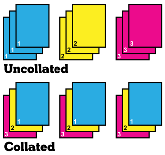

# accumulator pattern; mapping patterns to loops; string indexing
_COSC 101, Introduction to Computing I, 2021-09-15_

## Announcements
* Homework 2 due tomorrow at 5pm

## Outline
* Range
* Accumulator pattern
* Mapping patterns to loops

## No warm-up; Happy Wednesday!

## Range

### Overview
* Function that generates a sequence of integers
* `range(NUM)` — generates a sequence of `NUM` integers from `0` to `NUM-1`
    * E.g., `range(3)` ↠ `[0, 1, 2]`
* `range(START, STOP)` — generates a sequence of `STOP-START` integers from `START` to `STOP-1`
    * E.g., `range(2,5)` ↠ `[2, 3, 4]`
* `range(START, STOP, INCREMENT)` — generates a sequence of integers from `START` to `(STOP-1)*INCREMENT`, with `INCREMENT` added to each successive integer
    * E.g., `range(2,8,2)` ↠ `[2, 4, 6]`
* Sequence of integers is generated on-demand — use `list(range(...))` to get the full sequence

### Practice

_What sequence of integers is produced by each of the following invocations of range?_


```python
#1)
list(range(6))
```


    [0, 1, 2, 3, 4, 5]


```python
#2)
list(range(10, 15))
```


    [10, 11, 12, 13, 14]


```python
#3)
list(range(5, 10))
```


    [5, 6, 7, 8, 9]


```python
#4)
list(range(0, 7, 3))
```


    [0, 3, 6]


```python
#5)
list(range(20, 15, -1))
```


    [20, 19, 18, 17, 16]


```python
#6)
list(range(14, -15, -7))
```


    [14, 7, 0, -7, -14]


_What call to range would produce each of the following sequences of integers?_

\#1) `[10, 20, 30, 40, 50]`


```python
list(range(10, 51, 10))
```


    [10, 20, 30, 40, 50]


\#2) `[101, 102, 103, 104]`


```python
list(range(101, 105))
```


    [101, 102, 103, 104]


\#3) `[15, 12, 9, 6]`


```python
list(range(15, 5, -3))
```


    [15, 12, 9, 6]


\#4) `[0, 2, 4, 6, 8, 10]`


```python
list(range(0, 11, 2))
```


    [0, 2, 4, 6, 8, 10]


## Accumulator pattern

### Overview
* Process of iteratively updating a variable
* To use the accumulator pattern, you must know:
    * What do you want to compute?
    * What is its type?
    * How can you build it one piece at a time?
* Applying the pattern
    ```Python
    accumVar = 0 # initialize accumulator variable; use the correct type
    for i in range(10): # iterate desired number of times
        accumVar = accumVar + 1 # update accumulator variable
    print(accumVar) # value of accumVar after the loop is the final result
    ```
    
### Example: computing an average


```python
sum = 0
for i in range(4):
    sum += int(input("Enter a number: "))
avg = sum / 4
print(avg)
```

    Enter a number:  2
    Enter a number:  4
    Enter a number:  6
    Enter a number:  8


    5.0


_What is the output of the following programs? If necessary, provide input of your choosing._


```python
#1)
f = 1
for i in range(1, 4):
    f = f * i
print(f)
```

    6


```python
#2)
word = input("Enter a word: ")
spell = ""
for c in word:
    spell += c + "-"
print(spell)
```

    Enter a word:  encyclopedia


    e-n-c-y-c-l-o-p-e-d-i-a-


```python
#3)
greeting = "Hello "
for part in ['first','last']:
    name = input("What is your " + part + " name? ")
    greeting = greeting + name + " "
print(greeting)
```

    What is your first name?  Clarence
    What is your last name?  Ellis


    Hello Clarence Ellis 


(Clarence "Skip" Ellis was the first African-American to earn a Ph.D. in computer science, a pioneer in Computer Supported Cooperative Work and Groupware, and the first African-American to be elected as a Fellow of the Association for Computing Machinery (ACM).)

```


```
🛑 **STOP HERE** after completing the above problems; please **DO NOT WORK AHEAD**. If you have extra time, work on the extra practice problems at the end of the worksheet.

## Mapping patterns to loops

### Process
1. Identify repeated tasks — tasks may not be _exactly_ the same
2. Determine which repeated tasks can be "collated"

    

3. Determine how many times the "collated" tasks need to be repeated
4. Write the tasks, using the loop variable to accommodate _slight_ differences between repetitions

### Example


```python
import turtle
window = turtle.Screen()
dora = turtle.Turtle()
dora.left(90)
dora.forward(50)
dora.right(90)
dora.forward(50)
dora.left(90)
dora.forward(50)
dora.right(90)
dora.forward(50)
dora.left(90)
dora.forward(50)
dora.right(90)
dora.forward(50)
window.exitonclick()
```


```python
import turtle
window = turtle.Screen()
dora = turtle.Turtle()
for i in range(0, 3):
    dora.left(90)
    dora.forward(50)
    dora.right(90)
    dora.forward(50)
window.exitonclick()
```

### Practice
_Each of the following programs contains redundant code. Rewrite the program to use a loop and eliminate the redundancy._


```python
#1)
import random
die1 = random.randrange(0,6)
die2 = random.randrange(0,6)
die3 = random.randrange(0,6)
print("Die 1: " + str(die1))
print("Die 2: " + str(die2))
print("Die 3: " + str(die3))
```


```python
import random
for num in [1,2,3]:
    roll = random.randrange(0,6)
    print("Die " + str(num) + ": " + str(roll))
```


```python
#2)
import turtle
window = turtle.Screen()
crush = turtle.Turtle()
crush.forward(10)
crush.right(90)
crush.forward(20)
crush.right(90)
crush.forward(30)
crush.right(90)
crush.forward(40)
crush.right(90)
crush.forward(50)
crush.right(90)
crush.forward(60)
crush.right(90)
crush.forward(70)
crush.right(90)
crush.forward(80)
crush.right(90)
window.exitonclick()
```


```python
import turtle
window = turtle.Screen()
crush = turtle.Turtle()
for i in range(10, 90, 10):
    crush.forward(i)
    crush.right(90)
window.exitonclick()
```


```python
#3)
import turtle
window = turtle.Screen()
ash = turtle.Turtle()
ash.left(120)
ash.forward(100)
ash.left(120)
ash.forward(100)
ash.left(120)
ash.forward(100)
ash.left(180)
ash.left(120)
ash.forward(100)
ash.left(120)
ash.forward(100)
ash.left(120)
ash.forward(100)
window.exitonclick()
```


```python
import turtle
window = turtle.Screen()
ash = turtle.Turtle()
ash.pensize(3)
for side in [1,2,3]:
    ash.left(120)
    ash.forward(100)
ash.left(180)
for side in [1,2,3]:
    ash.left(120)
    ash.forward(100)
window.exitonclick()
```


```python
#4)
print("1 is odd")
print("2 is even")
print("3 is odd")
print("4 is even")
print("5 is odd")
print("6 is even")
```


```python
for num in range(1, 7):
    if (num % 2 == 0):
        print(num, "is even")
    else:
        print(num, "is odd")
```

## Extra practice
\#1) _Write a program that asks a user how many steps they walked each day of the week and computes their step total for the week._


```python
week_steps = 0
for day in ["Sun","Mon","Tues","Wed","Thurs","Fri","Sat"]:
    daily_steps = input("How many steps did you walk on "+day+"? ")
    week_steps += int(daily_steps)
print("You walked " + str(week_steps) + " this week")
```

\#2) _Write a program that asks for the dimensions of multiple rooms and computes the total square footage of a house or apartment._


```python
total_area = 0.0
for room in ["living room", "kitchen", "bedroom", "bathroom"]:
    length = float(input("What is the length of the " + room + "? "))
    width = float(input("What is the width of the " + room + "? "))
    room_area = length * width
    total_area += room_area
print("The total square footage is " + str(total_area))
```

\#3) _Write a program that flips a coin as many times as the user requested and outputs the percentage of flips that were heads._


```python
import random
# Ask for number of flips
flips = int(input("How many flips? "))
heads = 0
# Flip and count heads
for i in range(0, flips):
    coin = random.randint(0,1)
    if (coin == 0):
        heads += 1
# Display results
percent = heads/flips * 100
print(str(percent)+"% of the slips were heads")
```

\#4) _Write a program that asks for ten positive numbers and outputs the largest number._


```python
largest = 0
for i in range(0, 10):
    num = int(input("Enter a positive number: "))
    if num > largest:
        largest = num
print("The largest number is", largest)
```
