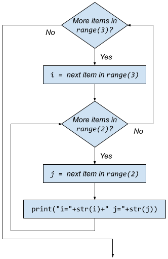

# nested loops
_COSC 101, Introduction to Computing I, 2021-10-13_

## Announcements
* Homework 5 due tomorrow at 5pm
* Exam 2 next Wednesday

## Outline
* Warm-up
* Nested for loops

## Warm-up

\#1) _Write a function called `ask_question` that takes a yes/no question and returns `True` or `False` depending on whether the user answered yes or no, respectively. (Hint: use the polling pattern)_


```python
def ask_question(question):
    choice = ""
    while choice != "Y" and choice != "N":
        choice = input(question + " (Y/N) ")
    if choice == "Y":
        return True
    else:
        return False
```

\#2) _Write a function called `get_max_digit` that takes a string of digits and returns the largest digit. For example, `get_max_digit("3142")` should return `4`. (Hint: use the accumulator pattern)_


```python
def get_max_digit(digits):
    largest = -1
    for digit in digits:
        if int(digit) > largest:
            largest = int(digit)
    return digit
```

\#3) _Write a function called `total_caffeine` that asks the user to enter the milligrams (mg) of caffeine for each beverage they consumed in a day until the user indicates they are done consuming beverages. The function should return the total caffeine consumed. (Hint: use the sentinel pattern and the accumulator pattern)_


```python
def total_caffeine():
    total = 0
    still_consuming = True
    while still_consuming:
        content = int(input("How many mg of caffeine did the beverage contain? "))
        if (content < 0):
            still_consuming = False
        else:
            total = total + content
    return total
```

## Nested for loops

* Body of for loop may contain another for loop

### Example


```python
for i in range(3): # Outer for loop
    for j in range(2): # Inner for loop
        print("i=" + str (i) + " j=" + str(j))
```

    i=0 j=0
    i=0 j=1
    i=1 j=0
    i=1 j=1
    i=2 j=0
    i=2 j=1




### Practice
_What is the output of each of the following programs?_


```python
#1)
for e in [2,4,6]:
    print("E=" + str(e))
    for f in range(1,6,2):
        print("Pair=" + str(e) + "," + str(f))
    print("F=" + str(f))
```

    E=2
    Pair=2,1
    Pair=2,3
    Pair=2,5
    F=5
    E=4
    Pair=4,1
    Pair=4,3
    Pair=4,5
    F=5
    E=6
    Pair=6,1
    Pair=6,3
    Pair=6,5
    F=5


```python
#2)
for i in ['a','b','c']:
    for j in range(1,4):
        print(i*j, end=" ")
    print("")
```

    a aa aaa 
    b bb bbb 
    c cc ccc 


```python
#3)
max = 3
for i in range(1,max+1):
    for j in range(1, max):
        print(str(i) * j, end=" ")
    for j in range(max, 0, -1):
        print(str(i) * j, end=" ")
    print("")
```

    1 11 111 11 1 
    2 22 222 22 2 
    3 33 333 33 3 


```python
#4)
for i in range(1,5):
    for j in range(i):
        print(str(i)+str(j), end=" ")
    print("")
```

    10 
    20 21 
    30 31 32 
    40 41 42 43 


## Extra practice
\#1) _Write a function called `hundreds_chart` that produces the following output:_
```
   1   2   3   4   5   6   7   8   9  10
  11  12  13  14  15  16  17  18  19  20
  21  22  23  24  25  26  27  28  29  30
  31  32  33  34  35  36  37  38  39  40
  41  42  43  44  45  46  47  48  49  50
  51  52  53  54  55  56  57  58  59  60
  61  62  63  64  65  66  67  68  69  70
  71  72  73  74  75  76  77  78  79  80
  81  82  83  84  85  86  87  88  89  90
  91  92  93  94  95  96  97  98  99 100
```

_You can use the following helper function to help you align all of the numbers:_


```python
def print_num_right_align(num):
    num = str(num)
    pad = 4 - len(num)
    print((" " * pad) + num, end="")
```


```python
def hundreds_chart():
    """Displays a hundreds chart"""
    for row in range(0,10):
        for col in range(1,11):
            num = row * 10 + col
            print_num_right_align(num)
        print("")

hundreds_chart()
```

       1   2   3   4   5   6   7   8   9  10
      11  12  13  14  15  16  17  18  19  20
      21  22  23  24  25  26  27  28  29  30
      31  32  33  34  35  36  37  38  39  40
      41  42  43  44  45  46  47  48  49  50
      51  52  53  54  55  56  57  58  59  60
      61  62  63  64  65  66  67  68  69  70
      71  72  73  74  75  76  77  78  79  80
      81  82  83  84  85  86  87  88  89  90
      91  92  93  94  95  96  97  98  99 100


\#2) _Write a function called `multiplication_table` that takes a positive integer and outputs a multiplication chart from 1 through that number. For example `multiplication_table(5)` should produce:_
```
     |   1   2   3   4   5
-----+--------------------
   1 |   1   2   3   4   5
   2 |   2   4   6   8  10
   3 |   3   6   9  12  15
   4 |   4   8  12  16  20
   5 |   5  10  15  20  25
```

_Again, use the `print_num_right_align` helper function to help you align all of the numbers._


```python
def multiplication_table(upper):
    """Displays a multiplication table"""
    # Print column headers
    print("     |", end="")
    for col in range(1,upper+1):
        print_num_right_align(col)
    print("")
    
    # Print column header line
    print("-----+" + ("-" * (upper * 4)))
    
    # Print rows
    for row in range(1,upper+1):
        # Print row number
        print_num_right_align(row)
        print(" |", end="")
        
        # Print multiplication results
        for col in range(1,upper+1):
            num = row * col
            print_num_right_align(num)
        print("")

multiplication_table(5)
```

         |   1   2   3   4   5
    -----+--------------------
       1 |   1   2   3   4   5
       2 |   2   4   6   8  10
       3 |   3   6   9  12  15
       4 |   4   8  12  16  20
       5 |   5  10  15  20  25

