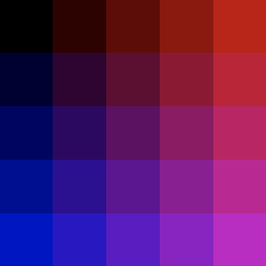
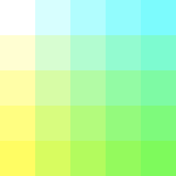
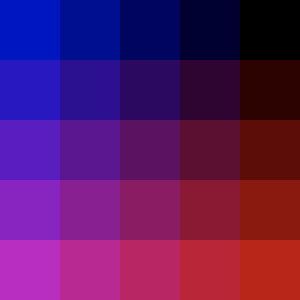
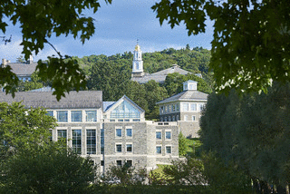
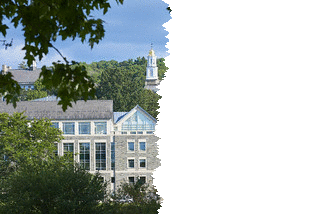

# image processing
_COSC 101, Introduction to Computing I, 2021-10-15_

## Announcements
* Exam 2 Wednesday

## Outline
* Warm-up
* Image processing

## Warm-up
_For each of the following programs, fill-in the blanks such that the program produces the desired output._


```python
#1)
for i in range(3):
    for j in range(3):
        print(______, end=" ")
    print("")
```

```
0 1 2  
0 1 2  
0 1 2 
```


```python
for i in range(3):
    for j in range(3):
        print(j, end=" ")
    print("")
```

    0 1 2 
    0 1 2 
    0 1 2 


```python
#2)
for i in ['c','b','a']:
    for j in range(____________):
        print(i*j, end=" ")
    print("")
```

```
ccc cc c 
bbb bb b 
aaa aa a 
```


```python
for i in ['c','b','a']:
    for j in range(3, 0 , -1):
        print(i*j, end=" ")
    print("")
```

    ccc cc c 
    bbb bb b 
    aaa aa a 


```python
#3)
for i in range(________):
    for j in range(________):
        print(j, end=" ")
    print("")
```

```
0 1 2 3 
1 2 3 4 
2 3 4 5 
3 4 5 6 
```


```python
for i in range(4):
    for j in range(i, i+4):
        print(j, end=" ")
    print("")
```

    0 1 2 3 
    1 2 3 4 
    2 3 4 5 
    3 4 5 6 


## Practice with nested for loops (continued)


```python
#3)
max = 3
for i in range(1,max+1):
    for j in range(1, max):
        print(str(i) * j, end=" ")
    for j in range(max, 0, -1):
        print(str(i) * j, end=" ")
    print("")
```

    1 11 111 11 1 
    2 22 222 22 2 
    3 33 333 33 3 


```python
#4)
for i in range(1,5):
    for j in range(i):
        print(str(i)+str(j), end=" ")
    print("")
```

    10 
    20 21 
    30 31 32 
    40 41 42 43 


## Image processing

### Overview
* Images are made up of dots called pixels, which form a grid
* Each pixel is a mix of red, green, and blue
    * Each value must be between 0 and 255 (inclusive)
* Use the `image` module to work with images
    * Load an image from a file using `image.Image("FILENAME")` replacing `FILENAME` with the name of the image file
    * Get the image dimensions using an image object's `getWidth()` and `getHeight()` functions
    * Get a particular pixel using an image object's `getPixel(x, y)` function with the appropriate x and y coordinates as arguments
    * Set a particular pixel using an image object's `setPixel(x, y, pix)` function with the appropriate x and y coordinates and a Pixel object
    * Create a pixel of a particular color using `image.pixel(red, green, blue)` with the appropriate red, green, and blue amounts

### Example: print pixel values




```python
import image

# create image object
img = image.Image('figures/images/grid.gif')

# get dimensions
width = img.getWidth()
height = img.getHeight()

# print color values for each pixel
for x in range(width):
    for y in range(height):
        # get pixel
        pix = img.getPixel(x, y)
        red = str(pix.getRed())
        green = str(pix.getGreen())
        blue = str(pix.getBlue())
        
        # output color values
        print('('+red+','+green+','+blue+')',end=' ')
    print()
```

    (0,0,0) (0,0,50) (0,0,100) (0,0,150) (0,0,200) 
    (50,0,0) (50,0,50) (50,0,100) (50,0,150) (50,0,200) 
    (100,0,0) (100,0,50) (100,0,100) (100,0,150) (100,0,200) 
    (150,0,0) (150,0,50) (150,0,100) (150,0,150) (150,0,200) 
    (200,0,0) (200,0,50) (200,0,100) (200,0,150) (200,0,200) 


### Example: invert pixel color




```python
import image

# create image object
img = image.Image('figures/images/grid.gif')
cpy = img.copy()

# get dimensions
width = img.getWidth()
height = img.getHeight()

# invert color values for each pixel
for x in range(width):
    for y in range(height):
        # get original pixel
        pix = img.getPixel(x, y)

        # compute inverted RGB
        r = 255 - pix.getRed()
        g = 255 - pix.getGreen()
        b = 255 - pix.getBlue()

        # update pixel in copy
        new_pix = image.Pixel(r, g, b)
        cpy.setPixel(x, y, new_pix)

cpy.save('figures/images/inverted.gif')
```

### Practice
_Write a program that rotates the grid image 90 degrees clockwise, resulting in the following image:_




```python
import image

# create image object
img = image.Image('figures/images/grid.gif')
cpy = img.copy()

# get dimensions
width = img.getWidth()
height = img.getHeight()

# invert color values for each pixel
for x in range(width):
    for y in range(height):
        # get original pixel
        pix = img.getPixel(x, y)

        # store in new location
        cpy.setPixel(width-1-y, x, pix)

cpy.save('figures/images/rotated.gif')
```

## Extra practice

\#1) _Write a function called `punnet_square` that takes two genotypes (as strings) and outputs a punnet square. For example `punnet_square("Gg", "gg")` should produce:_
```
  g  g  
G Gg Gg 
g gg gg 
```


```python
def punnet_square(maternal, paternal):
    print("  ", end="")
    for p in paternal:
        print(p + "  ", end="")
    print("")
    for m in maternal:
        print(m + " ", end="")
        for p in paternal:
            if (p > m):
                print(m + p + " ", end="")
            else:
                print(p + m + " ", end="")
        print("")
punnet_square("Gg", "gg")
```

      g  g  
    G Gg Gg 
    g gg gg 


\#2) _Write a function called `tear` that takes an image object and returns a copy of the image in which the right side of the image appears to have been torn-off, leaving a ragged edge in the middle of the image. For example:_

 

_(Hint: Use `random.randint` to choose where the tear occurs. Fill the right side of the image with white pixels.)_


```python
import image
import random

def tear(img):
    cpy = img.copy()
    height = cpy.getHeight()
    width = cpy.getWidth()
    mid = width // 2    
    white = image.Pixel(255, 255, 255)
    for y in range(height):
        mid = mid + random.randint(-2, 2)
        for x in range(mid, width):
            cpy.setPixel(x, y, white)
    return cpy


# create image object
img = image.Image('figures/images/colgate.gif')
cpy = tear(img)
cpy.save('figures/images/colgate_torn.gif')  
```
