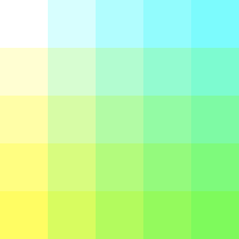
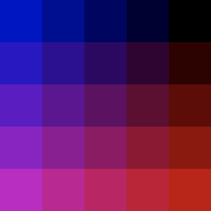

# image processing
_COSC 101, Introduction to Computing I, 2021-10-15_

## Announcements
* Exam 2 Wednesday

## Warm-up
_For each of the following programs, fill-in the blanks such that the program produces the desired output._


```python
#1)
for i in range(3):
    for j in range(3):
        print(______, end=" ")
    print("")
```

```
0 1 2  
0 1 2  
0 1 2 
```


```python
#2)
for i in ['c','b','a']:
    for j in range(____________):
        print(i*j, end=" ")
    print("")
```

```
ccc cc c 
bbb bb b 
aaa aa a 
```


```python
#3)
for i in range(________):
    for j in range(________):
        print(j, end=" ")
    print("")
```

```
0 1 2 3 
1 2 3 4 
2 3 4 5 
3 4 5 6 
```

🛑 **STOP HERE** after completing the warm-up; please **DO NOT WORK AHEAD**. If you have extra time, work on the extra practice problems.

<div style="page-break-after:always;"></div>

## Image processing

### Example: print pixel values


```python
import image

# create image object
img = image.Image('figures/images/grid.gif')

# get dimensions
width = img.getWidth()
height = img.getHeight()

# print color values for each pixel
for x in range(width):
    for y in range(height):
        # get pixel
        pix = img.getPixel(x, y)
        red = str(pix.getRed())
        green = str(pix.getGreen())
        blue = str(pix.getBlue())
        
        # output color values
        print('('+red+','+green+','+blue+')',end=' ')
    print()
```

<div style="page-break-after:always;"></div>

### Example: invert pixel color




```python
import image

# create image object
img = image.Image('figures/images/grid.gif')
cpy = img.copy()

# get dimensions
width = img.getWidth()
height = img.getHeight()

# invert color values for each pixel
for x in range(width):
    for y in range(height):
        # get original pixel
        pix = img.getPixel(x, y)

        # compute inverted RGB
        r = 255 - pix.getRed()
        g = 255 - pix.getGreen()
        b = 255 - pix.getBlue()

        # update pixel in copy
        new_pix = image.Pixel(r, g, b)
        cpy.setPixel(x, y, new_pix)

cpy.save('figures/images/inverted.gif')
```

<div style="page-break-after:always;"></div>

### Practice
_Write a program that rotates the grid image 90 degrees clockwise, resulting in the following image:_



<div style="page-break-after:always;"></div>

## Extra practice

\#1) _Write a function called `punnet_square` that takes two genotypes (as strings) and outputs a punnet square. For example `punnet_square("Gg", "gg")` should produce:_
```
  g  g  
G Gg Gg 
g gg gg 
```

```


```

\#2) _Write a function called `tear` that takes an image object and returns a copy of the image in which the right side of the image appears to have been torn-off, leaving a ragged edge in the middle of the image. For example:_

 

_(Hint: Use `random.randint` to choose where the tear occurs. Fill the right side of the image with white pixels.)_
