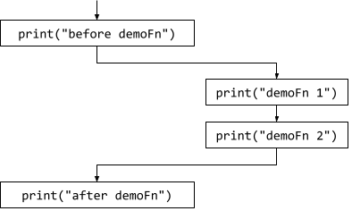

# Functions: definition; parameters
_COSC 101, Introduction to Computing I, 2024-09-11_

## Announcements
* Homework 1 due Thursday at 11:59pm

## Outline
* Warm-up
* Defining functions
* Control flow
* Parameters

## Warm-up

_What is the output of the following program? Assume the user enters `frog` and `20` for the inputs._


```python
word = input("What did you see? ")
print("That is a", type(word))
lower = 10
upper = lower + 20
lower = len(word)
print("I saw", str(lower) + "-" + str(upper), "of them, not", lower - upper)
count = input("How many" + word + "s did you see?")
updated = str(lower) + count
print("I also saw", updated, type(count))
updated = upper + int(count)
print("I wish I saw", updated, word, "s")
```

    What did you see?  frog


    That is a <class 'str'>
    I saw 4-30 of them, not -26


    How manyfrogs did you see? 20


    I also saw 420 <class 'str'>
    I wish I saw 50 frog s


<div style="height:10em;"></div>

_Write a program that asks a user for their age and outputs the year they were born, how old they will be in 2050, and in what year they will twice their current age._


```python
age = int(input("How old are you? "))
born = 2024 - age
print("You were born in", born)
expected = 2050 - 2024 + age
print("You will be", expected, "in 2050")
twice = age * 2 + 2024
print("You will be twice as old in", twice)
```

    How old are you?  37


    You were born in 1987
    You will be 63 in 2050
    You will be twice as old in 2098


<div style="height:15em;"></div>

🛑 **STOP here** after completing the warm-up; if you have extra time **skip** to the extra practice.

<div style="page-break-after:always;"></div>
<div style="page-break-after:always;"></div>

## Recall: computational thinking

* Recall that patterns and abstraction are two important parts of computational thinking
    * _How do these apply to our cupcake recipe program?_


```python
dozen = int(input("How many dozen cupcakes do you want?"))
print("Ingredients:")
print("*", dozen, "cups flour")
print("*", dozen * 1/4, "tsp salt")
print("*", dozen, "tsp baking powder")
print("*", dozen * 1/4, "cups butter")
print("*", dozen * 3/8, "cups sugar")
print("*", dozen, "eggs")
print("*", dozen * 1/2, "cups milk")
print("Directions:")
print("1. Preheat oven to 375°F.")
print("2. Put liners in " + str(dozen * 12) + " muffin cups.")
print("3. Cream butter and sugar until light and fluffy. Beat in eggs one at a time.")
print("4. Combine flour, salt, and baking soda.")
print("5. Add flour mixture and milk to butter and sugar; beat well.")
print("6. Divide batter evenly among " + str(dozen * 12) + " muffin cups.")
print("7. Bake for 18 minutes or until a toothpick comes out clean. Cool in pans.")
```

* We should divide our code into pieces, just like we divide the problem into pieces
    * Start by adding some blank lines to separate sections of the code


```python
dozen = int(input("How many dozen cupcakes do you want?"))

print("Ingredients:")
print("*", dozen, "cups flour")
print("*", dozen * 1/4, "tsp salt")
print("*", dozen, "tsp baking powder")
print("*", dozen * 1/4, "cups butter")
print("*", dozen * 3/8, "cups sugar")
print("*", dozen, "eggs")
print("*", dozen * 1/2, "cups milk")

print("Directions:")
print("1. Preheat oven to 375°F.")
print("2. Put liners in " + str(dozen * 12) + " muffin cups.")
print("3. Cream butter and sugar until light and fluffy. Beat in eggs one at a time.")
print("4. Combine flour, salt, and baking soda.")
print("5. Add flour mixture and milk to butter and sugar; beat well.")
print("6. Divide batter evenly among " + str(dozen * 12) + " muffin cups.")
print("7. Bake for 18 minutes or until a toothpick comes out clean. Cool in pans.")
```

## Defining functions

<div style="height:20em;"></div>

* Group related lines into functions
* Recall from the reading: _how do we create our own function?_
    * Indent statements within function


```python
def function_name():
    First statement in function
    Second statement in function
    ...
```

* Let's modify our cupcake program to include functions


```python
dozen = int(input("How many dozen cupcakes do you want?"))

def ingredients():
    print("Ingredients:")
    print("*", dozen, "cups flour")
    print("*", dozen * 1/4, "tsp salt")
    print("*", dozen, "tsp baking powder")
    print("*", dozen * 1/4, "cups butter")
    print("*", dozen * 3/8, "cups sugar")
    print("*", dozen, "eggs")
    print("*", dozen * 1/2, "cups milk")

def directions():
    print("Directions:")
    print("1. Preheat oven to 375°F.")
    print("2. Put liners in " + str(dozen * 12) + " muffin cups.")
    print("3. Cream butter and sugar until light and fluffy. Beat in eggs one at a time.")
    print("4. Combine flour, salt, and baking soda.")
    print("5. Add flour mixture and milk to butter and sugar; beat well.")
    print("6. Divide batter evenly among " + str(dozen * 12) + " muffin cups.")
    print("7. Bake for 18 minutes or until a toothpick comes out clean. Cool in pans.")
```

    How many dozen cupcakes do you want? 2


* _Why does our program no longer print the ingredients and directions?_ – need to call the functions!


```python
dozen = int(input("How many dozen cupcakes do you want?"))
ingredients()
directions()

def ingredients():
    print("Ingredients:")
    print("*", dozen, "cups flour")
    print("*", dozen * 1/4, "tsp salt")
    print("*", dozen, "tsp baking powder")
    print("*", dozen * 1/4, "cups butter")
    print("*", dozen * 3/8, "cups sugar")
    print("*", dozen, "eggs")
    print("*", dozen * 1/2, "cups milk")

def directions():
    print("Directions:")
    print("1. Preheat oven to 375°F.")
    print("2. Put liners in " + str(dozen * 12) + " muffin cups.")
    print("3. Cream butter and sugar until light and fluffy. Beat in eggs one at a time.")
    print("4. Combine flour, salt, and baking soda.")
    print("5. Add flour mixture and milk to butter and sugar; beat well.")
    print("6. Divide batter evenly among " + str(dozen * 12) + " muffin cups.")
    print("7. Bake for 18 minutes or until a toothpick comes out clean. Cool in pans.")
```

* _Why we receive an error that `ingredients` is not defined?_ – function must be defined before it is called


```python
dozen = int(input("How many dozen cupcakes do you want?"))

def ingredients():
    print("Ingredients:")
    print("*", dozen, "cups flour")
    print("*", dozen * 1/4, "tsp salt")
    print("*", dozen, "tsp baking powder")
    print("*", dozen * 1/4, "cups butter")
    print("*", dozen * 3/8, "cups sugar")
    print("*", dozen, "eggs")
    print("*", dozen * 1/2, "cups milk")

def directions():
    print("Directions:")
    print("1. Preheat oven to 375°F.")
    print("2. Put liners in " + str(dozen * 12) + " muffin cups.")
    print("3. Cream butter and sugar until light and fluffy. Beat in eggs one at a time.")
    print("4. Combine flour, salt, and baking soda.")
    print("5. Add flour mixture and milk to butter and sugar; beat well.")
    print("6. Divide batter evenly among " + str(dozen * 12) + " muffin cups.")
    print("7. Bake for 18 minutes or until a toothpick comes out clean. Cool in pans.")

ingredients()
directions()
```

## Control flow

* _In what order do the lines of code execute?_
    * Call to input
    * Definition of ingredients
    * Defintion of directions
    * Call to ingredients – execute every print statement in ingredients function
    * Call to directions – execute every print statement in directions function

* Confusing to have some code at the top, some code at the bottom, and some code in functions
    * Add a function called `main`, which is where the program starts
    * Still need a call to `main` at the very end of the file


```python
def ingredients():
    print("Ingredients:")
    print("*", dozen, "cups flour")
    print("*", dozen * 1/4, "tsp salt")
    print("*", dozen, "tsp baking powder")
    print("*", dozen * 1/4, "cups butter")
    print("*", dozen * 3/8, "cups sugar")
    print("*", dozen, "eggs")
    print("*", dozen * 1/2, "cups milk")

def directions():
    print("Directions:")
    print("1. Preheat oven to 375°F.")
    print("2. Put liners in " + str(dozen * 12) + " muffin cups.")
    print("3. Cream butter and sugar until light and fluffy. Beat in eggs one at a time.")
    print("4. Combine flour, salt, and baking soda.")
    print("5. Add flour mixture and milk to butter and sugar; beat well.")
    print("6. Divide batter evenly among " + str(dozen * 12) + " muffin cups.")
    print("7. Bake for 18 minutes or until a toothpick comes out clean. Cool in pans.")'

def main():
    dozen = int(input("How many dozen cupcakes do you want?"))
    ingredients()
    directions()

main()
```


```python
def demoFn():
    print("demoFn 1")
    print("demoFn 2")

def main():
    print("before demoFn")
    demoFn()
    print("after demoFn")

main()
```

    before demoFn
    demoFn 1
    demoFn 2
    after demoFn




* _Why we receive an error that `dozen` is not defined?_ – variables are not shared between functions
* _How do we provide values to functions?_ – using parameters

## Parameters

* _How do we define a function that takes a parameter?_


```python
def function_name(parameter_name: parameter_type):
    First statement in function
    Second statement in function
    ...
```


```python
def ingredients(dozen: int):
    print("Ingredients:")
    print("*", dozen, "cups flour")
    print("*", dozen * 1/4, "tsp salt")
    print("*", dozen, "tsp baking powder")
    print("*", dozen * 1/4, "cups butter")
    print("*", dozen * 3/8, "cups sugar")
    print("*", dozen, "eggs")
    print("*", dozen * 1/2, "cups milk")

def directions(dozen: int):
    print("Directions:")
    print("1. Preheat oven to 375°F.")
    print("2. Put liners in " + str(dozen * 12) + " muffin cups.")
    print("3. Cream butter and sugar until light and fluffy. Beat in eggs one at a time.")
    print("4. Combine flour, salt, and baking soda.")
    print("5. Add flour mixture and milk to butter and sugar; beat well.")
    print("6. Divide batter evenly among " + str(dozen * 12) + " muffin cups.")
    print("7. Bake for 18 minutes or until a toothpick comes out clean. Cool in pans.")

def main():
    dozen = int(input("How many dozen cupcakes do you want?"))
    ingredients(dozen)
    directions(dozen)

main()
```

* Not necessary to use the same name for the parameter in the function definition and the function call
    * They are two separate variables regardless of whether or not they have the same name
    * A change to a parameter within a function does not impact the parameter included in the function call


```python
def ingredients(dozen: int):
    print("Ingredients:")
    print("*", dozen, "cups flour")
    print("*", dozen * 1/4, "tsp salt")
    print("*", dozen, "tsp baking powder")
    print("*", dozen * 1/4, "cups butter")
    print("*", dozen * 3/8, "cups sugar")
    print("*", dozen, "eggs")
    print("*", dozen * 1/2, "cups milk")

def directions(dozen: int):
    dozen = dozen * 2
    print("Directions:")
    print("1. Preheat oven to 375°F.")
    print("2. Put liners in " + str(dozen * 12) + " muffin cups.")
    print("3. Cream butter and sugar until light and fluffy. Beat in eggs one at a time.")
    print("4. Combine flour, salt, and baking soda.")
    print("5. Add flour mixture and milk to butter and sugar; beat well.")
    print("6. Divide batter evenly among " + str(dozen * 12) + " muffin cups.")
    print("7. Bake for 18 minutes or until a toothpick comes out clean. Cool in pans.")

def main():
    desired = int(input("How many dozen cupcakes do you want?"))
    ingredients(desired)
    directions(desired)
    print("Now you have", desired, "dozen cupcakes!")

main()
```

## Functions

_What does the following program output?_


```python
def greet(name: str):
    print("Hello, " + name)

def welcome():
    print("Welcome to Hamilton!")

def sports(a: str, b: str):
    print("You can play " + a + " or " + b)

def main():
    greet("Aaron")
    welcome()
    sports("tennis", "basketball")
    
main()
```

    Hello, Aaron
    Welcome to Hamilton!
    You can play tennis or basketball


<div style="height:8em;"></div>

_What does the following program output?_


```python
def greet(name: str):
    print("Hello, " + name)

def welcome():
    print("Welcome to Hamilton!")

def sports(a: str, b: str):
    print("You can play " + a + " or " + b)

def main():
    welcome()
    sports("tennis", "basketball")
    sports("football", "volleyball")
    greet("Aaron")
    
main()
```

    Welcome to Hamilton!
    You can play tennis or basketball
    You can play football or volleyball
    Hello, Aaron


<div style="height:8em;"></div>

_For each of the following programs, indicate: (1) what the program outputs; (2) the order in which the statements will execute, starting with the `print("BEGIN")` statement_


```python
def halve(a: int):   # Line 1
    print(a / 2)     # Line 2
    
def double(b: int):  # Line 3
    print(b * 2)     # Line 4

def main():          # Line 5
    print("BEGIN")   # Line 6
    x = 8            # Line 7
    print("Double")  # Line 8
    double(x)        # Line 9
    print("Half")    # Line 10
    halve(x)         # Line 11
    print("END")     # Line 12

main()               # Line 13
```

    BEGIN
    Double
    16
    Half
    4.0
    END


1, 3, 5, 13, 6, 7, 8, 9, 4, 10, 11, 2, 12

<div style="height:10em;"></div>


```python
def sum(a: int, b: int): # Line 1
    print(a + b)     # Line 2

def main():          # Line 3
    print("BEGIN")   # Line 4
    sum(3, 4)        # Line 5
    x = 5            # Line 6
    y = 6            # Line 7
    sum(x, y)        # Line 8
    print("END")     # Line 9

main()               # Line 10
```

    BEGIN
    7
    11
    END


1, 3, 10, 4, 5, 2, 6, 7, 8, 2, 9

<div style="height:10em;"></div>


```python
def main():               # Line 1
    print("BEGIN")        # Line 2
    add(2, 3)             # Line 3
    x = 8                 # Line 4
    y = 2                 # Line 5
    sub(x, y)             # Line 6
    add(x + y, 1 + 2)     # Line 7
    print("END")          # Line 8

def add(a: int, b: int):  # Line 9     
    print(a + b)          # Line 10
    
def sub(c: int, d: int):  # Line 11
    print(c - d)          # Line 12

main()                    # Line 13
```

    BEGIN
    5
    6
    13
    END


1, 9, 11, 13, 2, 3, 10, 4, 5, 6, 12, 7, 10, 8

<div style="height:10em;"></div>


```python
def increment(x: int):   # Line 1 
    x = x + 1            # Line 2 

def main():              # Line 3
    a = 2                # Line 4 
    increment(a)         # Line 5
    print(a)             # Line 6

main()                   # Line 7
```

    2


1, 3, 7, 4, 5, 2, 6

<div style="height:5em;"></div>

## Extra practice

_Write a program that asks for an amount of change (in cents) and outputs how many quarters (25¢), dimes (10¢), nickels (5¢), and pennies (1¢) are needed to obtain the target amount._


```python
change = int(input("Change (in cents):"))
quarters = change // 25
change = change % 25
dimes = change // 10
change = change % 10
nickels = change // 5
change = change % 5
print(quarters, "quarters,", dimes, "dimes,", nickels, "nickels, and", change, "pennies")
```

    Change (in cents): 68


    2 quarters, 1 dimes, 1 nickels, and 3 pennies

