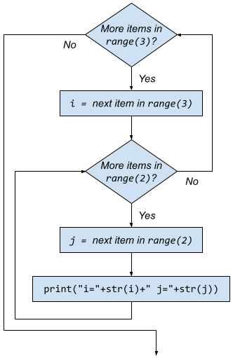

# Nested data: nested loops
_COSC 101, Introduction to Computing I, 2024-11-15_

## Announcements
* Exam 3 Friday, Nov 22
    * Study materials posted on Moodle

## Nested for loops

_Example_


```python
for i in range(3): # Outer for loop
    for j in range(2): # Inner for loop
        print("i=" + str (i) + " j=" + str(j))
```

    i=0 j=0
    i=0 j=1
    i=1 j=0
    i=1 j=1
    i=2 j=0
    i=2 j=1




<p style="height:47em;"></p>

_What is the output of each of the following programs?_


```python
def main() -> None:
    for e in [2,4,6]:
        print("E=" + str(e))
        for f in range(1,6,2):
            print("Pair=" + str(e) + "," + str(f))
        print("F=" + str(f))
main()
```

    E=2
    Pair=2,1
    Pair=2,3
    Pair=2,5
    F=5
    E=4
    Pair=4,1
    Pair=4,3
    Pair=4,5
    F=5
    E=6
    Pair=6,1
    Pair=6,3
    Pair=6,5
    F=5


<p style="height:20em;"></p>


```python
def main() -> None:
    for i in range(1,5):
        line = ""
        for j in range(i):
            line = line + str(i) + str(j) + " "
        print(line)
main()
```

    10 
    20 21 
    30 31 32 
    40 41 42 43 


<p style="height:8em;"></p>

_Write a function called `hundreds_chart` that produces the following output:_
```
   1   2   3   4   5   6   7   8   9  10
  11  12  13  14  15  16  17  18  19  20
  21  22  23  24  25  26  27  28  29  30
  31  32  33  34  35  36  37  38  39  40
  41  42  43  44  45  46  47  48  49  50
  51  52  53  54  55  56  57  58  59  60
  61  62  63  64  65  66  67  68  69  70
  71  72  73  74  75  76  77  78  79  80
  81  82  83  84  85  86  87  88  89  90
  91  92  93  94  95  96  97  98  99 100
```

_You can use the following helper function to help you align all of the numbers:_


```python
def print_num_right_align(num):
    num = str(num)
    pad = 4 - len(num)
    print((" " * pad) + num, end="")
```


```python
def hundreds_chart():
    """Displays a hundreds chart"""
    for row in range(0,10):
        for col in range(1,11):
            num = row * 10 + col
            print_num_right_align(num)
        print("")

hundreds_chart()
```

<p style="height:18em;"></p>

## Extra practice

_What is the output of each of the following programs?_


```python
def main() -> None:
    for i in ['a','b','c']:
        line = ""
        for j in range(1,4):
            line = line + (i * j) + " "
        print(line)
main()
```

    a aa aaa 
    b bb bbb 
    c cc ccc 


<p style="height:5em;"></p>


```python
def main() -> None:
    max = 3
    for i in range(1,max+1):
        for j in range(1, max):
            print(str(i) * j, end=" ")
        for j in range(max, 0, -1):
            print(str(i) * j, end=" ")
        print("")
main()
```

    1 11 111 11 1 
    2 22 222 22 2 
    3 33 333 33 3 


<p style="height:8em;"></p>

_Write a function called `multiplication_table` that takes a positive integer and outputs a multiplication chart from 1 through that number. For example `multiplication_table(5)` should produce:_
```
     |   1   2   3   4   5
-----+--------------------
   1 |   1   2   3   4   5
   2 |   2   4   6   8  10
   3 |   3   6   9  12  15
   4 |   4   8  12  16  20
   5 |   5  10  15  20  25
```

_Again, use the `print_num_right_align` helper function to help you align all of the numbers._


```python
def multiplication_table(upper):
    """Displays a multiplication table"""
    # Print column headers
    print("     |", end="")
    for col in range(1,upper+1):
        print_num_right_align(col)
    print("")
    
    # Print column header line
    print("-----+" + ("-" * (upper * 4)))
    
    # Print rows
    for row in range(1,upper+1):
        # Print row number
        print_num_right_align(row)
        print(" |", end="")
        
        # Print multiplication results
        for col in range(1,upper+1):
            num = row * col
            print_num_right_align(num)
        print("")

multiplication_table(5)
```

         |   1   2   3   4   5
    -----+--------------------
       1 |   1   2   3   4   5
       2 |   2   4   6   8  10
       3 |   3   6   9  12  15
       4 |   4   8  12  16  20
       5 |   5  10  15  20  25

